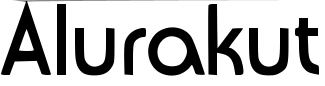

<p align="center">
  
</p>

## Súmario

- [Aplicação](#📲-aplicação)

- [Alurakut](#❓Alurakut❗)

- [Tecnologias presentes na aplicação](#🖥-tecnologias-presentes-na-aplicação)

- [Layout da aplicação](#layout-da-aplicação)

- [Funcionalidades](#funcionalidades)

- [Desafios](#🆙-desafios)

- [Clone, instalação e uso da aplicação](#🚀-clone-instalação-e-uso-da-aplicação)

- [Contribuindo com projeto](#contribuindo-com-projeto)

- [License](#license)

- [Contato](#📧-contato)

  

  

## 📲 Aplicação

- Este projeto consiste em estar recriando toda a interface do famoso Orkut, porém, batizado de Alurakut.

- Projeto foi desenvolvido durante a imersão React, lecionada através da plataforma Alura.

- Professores: Juliana Negreiros, Paulo e Mario Souto.


## ❓Alurakut❗

- Acessar a página da aplicação  =>  👾 [Alurakut](https://alurakut-bm-bmanduca.vercel.app)

  


## 🖥 Tecnologias presentes na aplicação

- React

  - Components
  - Styled Components
  - Hooks
  - Protocolo HTTP

- Requisições com GraphQL

- BFF

- Ajax

- NextJS

  

## **Layout da aplicação**

- **É possível verificar o layout da aplicação através do link -> [Layout Alurakut](https://www.figma.com/file/xHF0n0qxiE2rqjqAILiBUB/Alurakut)**

- **Lembrando, que para acessar o layout, é preciso ter uma conta no [Figma](http://figma.com)**

  

  

## 🆙 **Desafios**

- Documentação

  - [x] Criação de um Readme bem elaborado para o projeto
  - [x] Tecnologias e recursos utilizados no projeto
  - [x] Clone, instalação e utilização da aplicação
  - [ ] Print da aplicação
  
- Aula 01

  - [x] Pegar os dados da [API do Github](https://api.github.com/users/juunegreiros/followers) e listar seus seguidores.

  - [x] Adicionar quão confiável, legal e sexy você é.

  - [x] Usar Strategy ao invés de vários ifs no css

  - [x] Separar e organizar o código.

  - [x] Publicar o projeto.

  - [x] Deixar o projeto com minhas especificações.

    

- Aula 02

  - [ ] Criar suas comunidades para compartilhar
  - [ ] Facilitar cadastro da url da imagem
  - [ ] Adicionar links para as suas comunidades
  - [x] Adicionar o projeto na vitrine da alura
  - [x] Deixar o Readme bem top
  
- Aula 03
  - [ ] 
  
- Aula 04
  - [ ] 
  
- Aula 05
  - [ ] 


## **🚀 Clone, instalação e uso da aplicação**

- **Como indicação, você precisará das seguintes ferramentas para iniciar**

  - **[Node.js](https://nodejs.org/pt-br/) (versão LTS)**

  - **[Yarn](https://classic.yarnpkg.com/en/docs/install/) (versão LTS)**

  - **[Git](https://git-scm.com)**

  - **Para edição e desenvolvimento, eu indico o [VSCode](https://code.visualstudio.com/)**

    ```
    # Efetuar clone deste repositório
    $ (sudo) git clone https://github.com/BManduca/alurakut
    
    # Acessar a pasta da aplicação, através do terminal
    $ cd alurakut
    
    # Iniciar aplicação
    $ (sudo) yarn dev ou npm run dev
    
    # O servidor é iniciado através da porta -> 3000
    # O acesso ficará da seguinte forma -> http://localhost:3000/
    
    ```

    

## **Contribuindo com projeto**

- **Passo 01**

  **🍴Efetuar fork do repositório**

- **Passo 02**

  **👯 Efetuar clone do repositório para sua máquina local**

  ```
  git clone 
  ```

- **Passo 03**

  **🆕 Criar sua própria branch para aplicar suas alterações**

  ```
  git checkout -b 'name-your-branch'
  ```

- **Passo 04**

  **✅ Efetuar commit das suas alterações**

  ```
  git commit -m 'comentário para marcar o seu commit através da sua branch'
  ```

- **Passo 05**

  **📌 Efetuar push na sua branch** 

  ```
  git push origin 'name-your-branch'
  ```

- **Passo 06**

  **🔁 Criar novo pull request**


## **License**

**This project is under the MIT license. See the [LICENSE](LICENSE.md) file  for more details.**

## **📧 Contato**

**[](mailto:brunnomanducarfe@gmail.com) [](https://www.linkedin.com/in/brunno-manduca-b97080118/)** 


